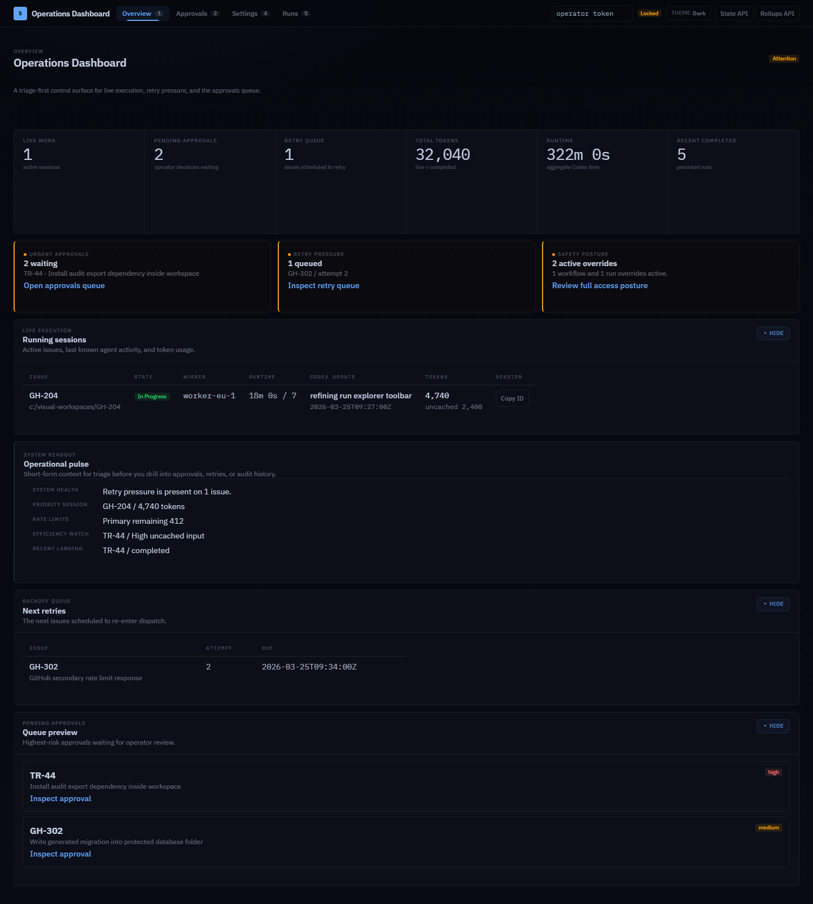
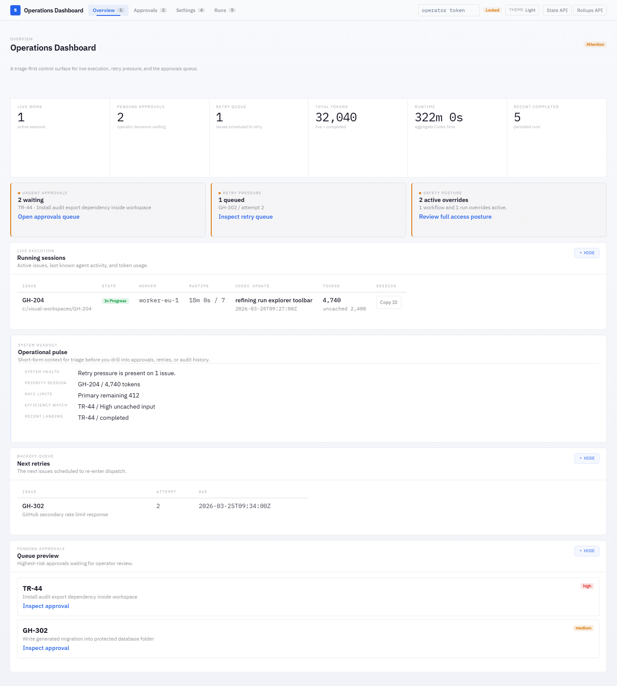
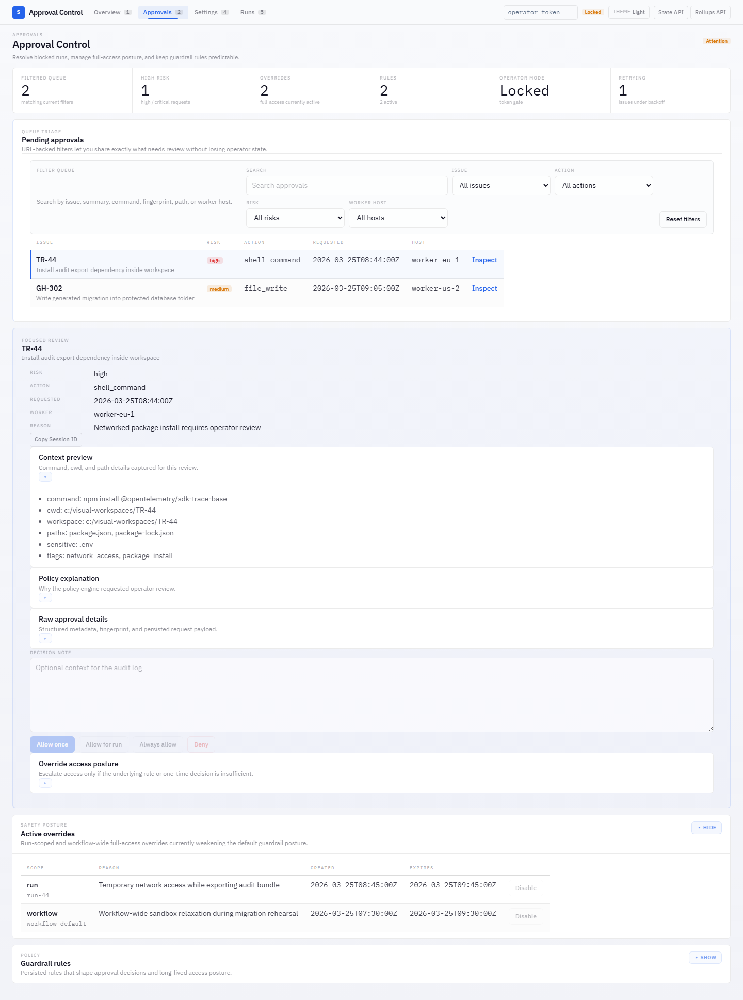
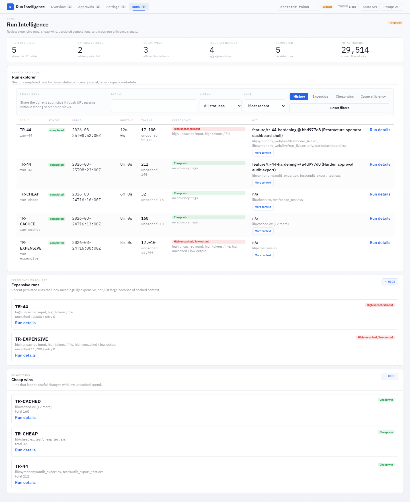
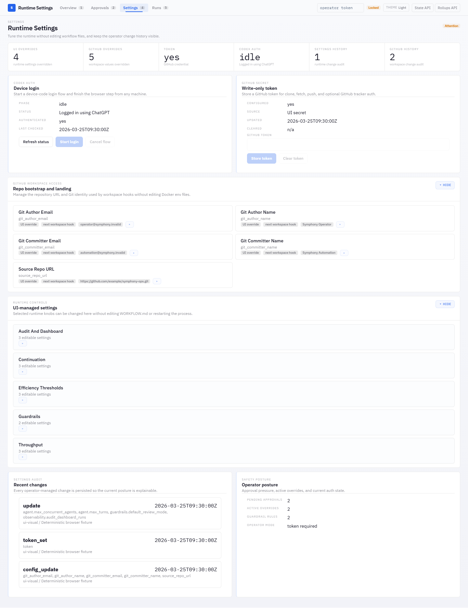
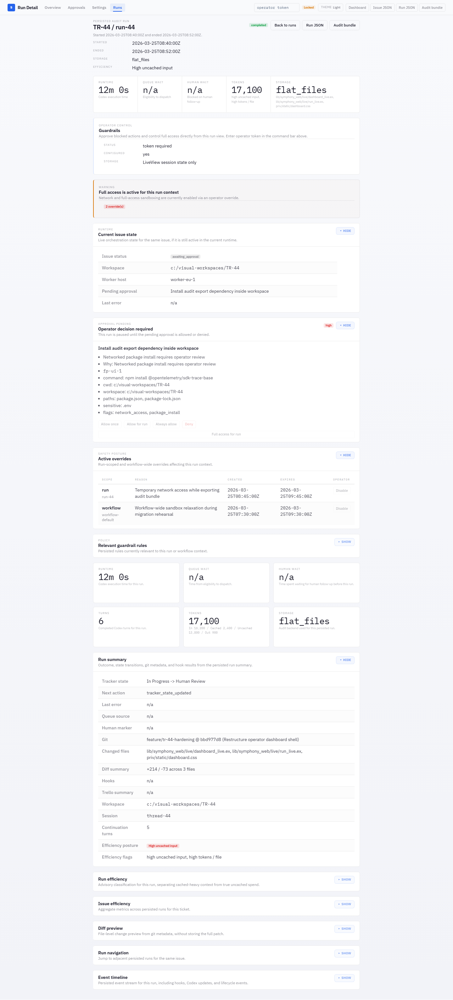

# Symphony Elixir

This directory contains the current Elixir/OTP implementation of Symphony, based on
[`SPEC.md`](../SPEC.md) at the repository root.

> [!WARNING]
> Symphony Elixir is prototype software intended for evaluation only and is presented as-is.
> We recommend implementing your own hardened version based on `SPEC.md`.

> [!IMPORTANT]
> Linux containers are the only supported runtime for Symphony Elixir. The Docker workflows in
> this directory are the supported deployment path.

## Dashboard

Symphony includes a real-time operator dashboard for monitoring agent sessions, approving guardrail-blocked actions, reviewing run efficiency, and tuning runtime settings.

### Overview — dark mode


### Overview — light mode


<details>
<summary>More screenshots</summary>

### Approval Control


### Run Intelligence


### Runtime Settings


### Run Detail


</details>

## How it works

1. Polls Linear, Trello, or GitHub for candidate work
2. Creates a workspace per issue
3. Launches Codex in [App Server mode](https://developers.openai.com/codex/app-server/) inside the
   workspace
4. Sends a workflow prompt to Codex
5. Keeps Codex working on the issue until the work is done

During app-server sessions, Symphony also serves a tracker-specific client-side tool:

- `linear_graphql` for Linear workflows
- `trello_api` for Trello workflows
- `github_graphql` and `github_api` for GitHub workflows

If a claimed issue moves to a terminal state (`Done`, `Closed`, `Cancelled`, or `Duplicate`),
Symphony stops the active agent for that issue and cleans up matching workspaces.

## Runtime model

Run Symphony in Docker on a Linux container runtime.

Why this is the supported mode:

- reproducible Elixir, Git, Node, and Codex runtime
- fewer shell and path inconsistencies
- cleaner workspace isolation and safer operator boundaries
- closer to the environment you will likely use in CI or on a server

## How to use it

1. Make sure your codebase is set up to work well with agents: see
   [Harness engineering](https://openai.com/index/harness-engineering/).
2. Choose a tracker workflow:
   - Trello in Docker: [WORKFLOW.trello.docker.md](WORKFLOW.trello.docker.md)
   - GitHub Projects v2 in Docker: [WORKFLOW.github.docker.md](WORKFLOW.github.docker.md)
3. Provide tracker credentials:
   - Linear: create a personal token in Settings -> Security & access -> Personal API keys and set
     `LINEAR_API_KEY`
   - Trello: set `TRELLO_API_KEY`, `TRELLO_API_TOKEN`, and `TRELLO_BOARD_ID`
     - The bundled Trello workflow now opens and updates GitHub PRs automatically after successful
       coding runs, so also set `GITHUB_TOKEN`, `GITHUB_OWNER`, and `GITHUB_REPO`.
   - GitHub: set `GITHUB_TOKEN`, `GITHUB_OWNER`, `GITHUB_REPO`, and `GITHUB_PROJECT_NUMBER`
   - Operator-authenticated admin actions: also set `SYMPHONY_OPERATOR_TOKEN`
4. Use the provided Docker workflow files directly with Compose.
5. Optionally copy the `commit`, `push`, `pull`, `land`, and `linear` skills to your repo.
   - The `linear` skill expects Symphony's `linear_graphql` app-server tool for raw Linear GraphQL
     operations such as comment editing or upload flows.
6. Customize the selected workflow file for your project.
   - To get your project's slug, right-click the project and copy its URL. The slug is part of the
     URL.
   - When creating a workflow based on this repo, note that it depends on non-standard Linear
     issue statuses: `Rework` and `Human Review`. You can customize them in
     Team Settings -> Workflow in Linear.
7. Follow the instructions below to install the required runtime dependencies and start the service.

## Docker Quick Start

This is the recommended default path.

1. Create a `docker-compose.env` file in `elixir/` using
   [docker-compose.env.example](docker-compose.env.example).
2. Keep your Trello secrets in [`.env`](.env) as before.
3. Choose a workflow file:
   - [WORKFLOW.trello.docker.md](WORKFLOW.trello.docker.md) for Trello
   - [WORKFLOW.github.docker.md](WORKFLOW.github.docker.md) for GitHub Projects v2
4. Start the stack:

```bash
cd elixir
docker compose --env-file docker-compose.env up --build
```

This container image includes:

- Elixir/Erlang for Symphony itself
- `codex` for `codex app-server`
- Git and OpenSSH client for repo bootstrap/push
- Node, npm, and Yarn for your current workspace bootstrap

The compose stack mounts:

- `./.env` into the container so Trello credentials still auto-load next to the workflow file
- a named Docker volume for issue workspaces at `/workspaces`
- a named Docker volume for Symphony logs at `/logs`
- a named Docker volume for the runtime home directory at `/home/symphony`

This means the workspaces and logs stay persistent across container recreation, but they do not need
to live in a host checkout folder.

Docker mode treats the container as the primary execution boundary. Symphony forces Codex to run
without in-run approval/resume mechanics in this mode, so operator review happens through the
workflow state `Human Review` instead of Codex command/file prompts.

The bundled Docker workflows also enable two efficiency defaults:

- `agent.max_issue_description_prompt_chars: 1600` to cap large tracker bodies before they hit the
  model prompt
- `agent.handoff_summary_enabled: true` so rework and follow-up runs get a compact previous-run
  handoff instead of re-deriving context from scratch

The dashboard is exposed on port `4000` by default.

## Developer prerequisites

We recommend using [mise](https://mise.jdx.dev/) to manage Elixir/Erlang versions.

```bash
mise install
mise exec -- elixir --version
```

## Configuration

The container entrypoint runs `./bin/symphony /run/symphony/WORKFLOW.md`. The mounted workflow file
still uses YAML front matter plus a Markdown body used as the Codex session prompt.

Optional flags:

- `--logs-root` tells Symphony to write logs under a different directory (default: `./log`)
- `--port` also starts the Phoenix observability service (default: disabled)

Minimal Linear example:

```md
---
tracker:
  kind: linear
  project_slug: "..."
workspace:
  root: ~/code/workspaces
hooks:
  after_create: |
    git clone git@github.com:your-org/your-repo.git .
agent:
  max_concurrent_agents: 10
  max_turns: 20
codex:
  command: codex app-server
---

You are working on a Linear issue {{ issue.identifier }}.

Title: {{ issue.title }} Body: {{ issue.description }}
```

Notes:

- If a value is missing, defaults are used.
- Symphony always forces the Codex runtime to container-boundary defaults:
  - `approval_policy: never`
  - `thread_sandbox: danger-full-access`
  - `turn_sandbox_policy.type: dangerFullAccess`
- The bundled Docker workflows set `agent.max_issue_description_prompt_chars: 1600` and
  `agent.handoff_summary_enabled: true` by default to reduce prompt bloat and make follow-up runs
  cheaper.
- Workflow `codex.approval_policy`, `codex.thread_sandbox`, and `codex.turn_sandbox_policy` values
  may still appear in parsed settings, but they are not used at runtime.
- `agent.max_turns` caps how many back-to-back Codex turns Symphony will run in a single agent
  invocation when a turn completes normally but the issue is still in an active state. Default: `20`.
- If the Markdown body is blank, Symphony uses a default prompt template that includes the issue
  identifier, title, and body.
- Use `hooks.after_create` to bootstrap a fresh workspace. For a Git-backed repo, you can run
  `git clone ... .` there, along with any other setup commands you need.
- If a hook needs `mise exec` inside a freshly cloned workspace, trust the repo config and fetch
  the project dependencies in `hooks.after_create` before invoking `mise` later from other hooks.
- `tracker.api_key` reads from `LINEAR_API_KEY` when unset or when value is `$LINEAR_API_KEY`.
- For Trello, `tracker.api_key` reads from `TRELLO_API_KEY`, `tracker.api_token` reads from
  `TRELLO_API_TOKEN`, and `tracker.board_id` reads from `TRELLO_BOARD_ID` when unset.
- Codex command/file approval prompts are not supported. Operator review happens through workflow
  states such as `Human Review`, not via in-run approval/resume mechanics.
- Symphony auto-loads `.env` from the same directory as the active `WORKFLOW.md` file without
  overriding already-exported process environment variables.
- For path values, `~` is expanded to the home directory.
- For env-backed path values, use `$VAR`. `workspace.root` resolves `$VAR` before path handling,
  while `codex.command` stays a shell command string and any `$VAR` expansion there happens in the
  launched shell.
- `codex.model` and `codex.reasoning_effort` can be layered on top of `codex.command`. Symphony
  rewrites the matching `--model` and `--config model_reasoning_effort=...` launch flags while
  preserving the rest of the command.

```yaml
tracker:
  api_key: $LINEAR_API_KEY
workspace:
  root: $SYMPHONY_WORKSPACE_ROOT
hooks:
  after_create: |
    git clone --depth 1 "$SOURCE_REPO_URL" .
codex:
  command: "$CODEX_BIN --config shell_environment_policy.inherit=all app-server"
  model: "gpt-5.1-codex-mini"
  reasoning_effort: "high"
```

- If `WORKFLOW.md` is missing or has invalid YAML at startup, Symphony does not boot.
- If a later reload fails, Symphony keeps running with the last known good workflow and logs the
  reload error until the file is fixed.
- `server.port` or CLI `--port` enables the optional Phoenix LiveView dashboard and JSON API at
  `/`, `/api/v1/state`, `/api/v1/<issue_identifier>`, and `/api/v1/refresh`.

## Web dashboard

The observability UI now runs on a minimal Phoenix stack:

- LiveView for the dashboard at `/`
- JSON API for operational debugging under `/api/v1/*`
- Bandit as the HTTP server
- Phoenix dependency static assets for the LiveView client bootstrap

## Project layout

- `lib/`: application code and Mix tasks
- `test/`: ExUnit coverage for runtime behavior
- `WORKFLOW.*.docker.md`: workflow contracts mounted into the container runtime
- `../.codex/`: repository-local Codex skills and setup helpers

## Testing

```bash
make all
```

Browser-level visual regression coverage for the LiveView dashboard lives under `ui-visual/` and
uses Playwright against a deterministic local fixture server:

```bash
cd elixir
npm install
npm run install:ui-browsers
npm run test:ui-visual
```

Refresh the committed screenshot baselines only after an intentional UI change:

```bash
cd elixir
npm run test:ui-visual:update
```

Run the real external end-to-end test only when you want Symphony to create disposable Linear
resources and launch a real `codex app-server` session:

```bash
cd elixir
export LINEAR_API_KEY=...
make e2e
```

Optional environment variables:

- `SYMPHONY_LIVE_LINEAR_TEAM_KEY` defaults to `SYME2E`
- `SYMPHONY_LIVE_SSH_WORKER_HOSTS` uses those SSH hosts when set, as a comma-separated list

`make e2e` runs two live scenarios:

- one with a local worker
- one with SSH workers

If `SYMPHONY_LIVE_SSH_WORKER_HOSTS` is unset, the SSH scenario uses `docker compose` to start two
disposable SSH workers on `localhost:<port>`. The live test generates a temporary SSH keypair,
verifies that Symphony can talk to the workers over real SSH, then runs the same orchestration
flow against those worker addresses. This keeps the transport representative without depending on
long-lived external machines.

Set `SYMPHONY_LIVE_SSH_WORKER_HOSTS` if you want `make e2e` to target real SSH hosts instead.

The live test creates a temporary Linear project and issue, writes a temporary `WORKFLOW.md`, runs
a real agent turn, verifies the workspace side effect, requires Codex to comment on and close the
Linear issue, then marks the project completed so the run remains visible in Linear.

For Trello setup guidance and a recommended board column layout, see [docs/trello.md](docs/trello.md).
For GitHub Projects v2 setup guidance, see [docs/github.md](docs/github.md).
For current guardrail and review-state behavior, see [docs/guardrails.md](docs/guardrails.md).

## Docker

This is the primary deployment path. It no longer requires mounting host `~/.ssh`, `~/.gitconfig`,
or `~/.codex/auth.json`. Instead:

- Trello credentials are loaded from [`.env`](.env) via Compose `env_file`
- repository access uses HTTPS and optional `GITHUB_TOKEN`
- Codex auth is persisted inside the named Docker volume mounted at `/home/symphony/.codex`

First-time Codex login inside Docker:

```bash
cd elixir
docker compose --env-file docker-compose.env run --rm symphony codex login
```

You can also complete device-code login from the dashboard after startup:

- open `/settings`
- enter the operator token configured in the workflow
- use the `Device login` panel to start `codex login --device-auth`
- finish the browser step with the shown URL and user code

Normal startup:

```bash
cd elixir
docker compose --env-file docker-compose.env up --build
```

Configuration:

- [docker-compose.env](docker-compose.env) controls dashboard port, workflow selection, repo URL,
  optional GitHub token, optional operator token, and Git author identity
- `SYMPHONY_WORKFLOW_FILE` selects the mounted workflow file
  (`./WORKFLOW.trello.docker.md` or `./WORKFLOW.github.docker.md`)
- [WORKFLOW.trello.docker.md](WORKFLOW.trello.docker.md) clones from
  `SYMPHONY_SOURCE_REPO_URL`, works on an issue branch, and opens or updates a PR automatically
- [WORKFLOW.github.docker.md](WORKFLOW.github.docker.md) additionally expects
  `GITHUB_OWNER`, `GITHUB_REPO`, and `GITHUB_PROJECT_NUMBER`
- Trello PR publication also expects `GITHUB_OWNER` and `GITHUB_REPO`, because successful runs
  create or update a GitHub pull request instead of pushing `main` directly
- the Docker image configures an in-container Git credential helper for `https://github.com`
  so `GITHUB_TOKEN` is used automatically for clone, fetch, and push inside the container
- once the stack is running, `/settings` can safely override the repo URL and Git identity, and can
  store a write-only GitHub token without exposing it back through the UI or API

## Support posture

- Supported runtime: Linux container runtime via Docker
- Local host execution: development and test tooling only, not a supported deployment mode

## FAQ

### Why Elixir?

Elixir is built on Erlang/BEAM/OTP, which is great for supervising long-running processes. It has an
active ecosystem of tools and libraries. It also supports hot code reloading without stopping
actively running subagents, which is very useful during development.

### What's the easiest way to set this up for my own codebase?

Launch `codex` in your repo, give it the URL to the Symphony repo, and ask it to set things up for
you.

## License

This project is licensed under the [Apache License 2.0](../LICENSE).
